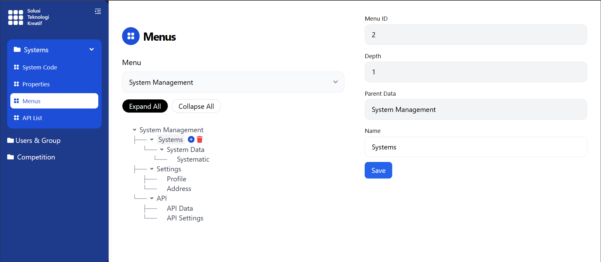
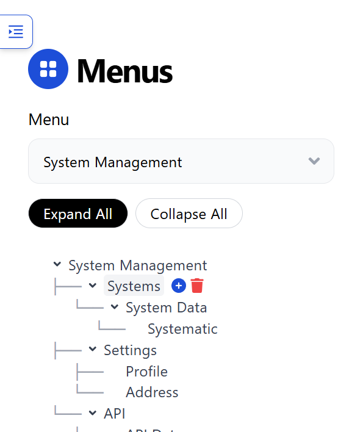
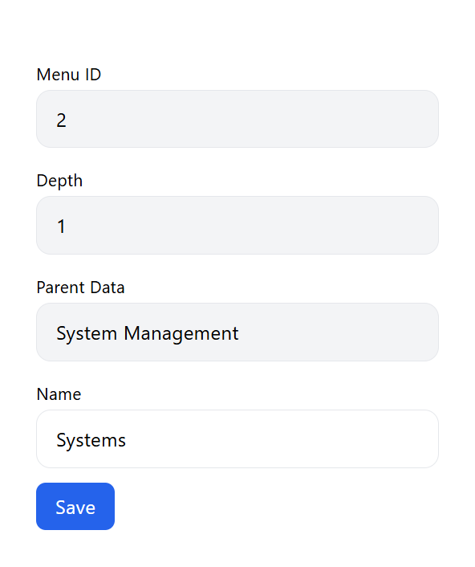

# Fullstack Menu Tree

Fullstack application untuk menampilkan menu tree lengkap dengan UI dan swagger.  
Backend: NestJS + PostgreSQL  
Frontend: Vite + React  

---

## Table of Contents

- [Prerequisites](#prerequisites)
- [Setup](#setup)
  - [Clone Repo](#clone-repo)
  - [Environment Variables](#environment-variables)
  - [Docker Setup](#docker-setup)
  - [Frontend & Backend Manual](#frontend--backend-manual)
- [Usage](#usage)
- [Important Note](#important-note)
- [Screenshots](#screenshots)
- [Technologies](#technologies)
- [License](#license)

---

## Prerequisites

- Git  
- Docker & Docker Compose  
- Node.js & npm (opsional, jika mau jalankan tanpa Docker)

---

## Setup
### Clone Repo
```bash
git clone https://github.com/daff11/fullstack-menu-tree.git
cd fullstack-menu-tree
```

### Environement Variables
Sudah include di git. Bisa dicek di folder backend/.env dan frontend/.env

### Docker Setup
Note: Sebelum menjalankan perintah di bawah, pastikan Docker dan Docker Compose sudah terinstal
```bash
docker-compose up --build
```

### Frontend dan Backend Manual
Jika ingin jalankan tanpa docker:
- Backend
  ```bash
  cd backend
  npm install
  npm run build
  npm run start
  ```
- Frontend
  ```bash
  cd frontend
  npm install
  npm run build
  npm run preview
  ```

## Usage
- Akses Frontend: http://localhost:5173
- Swagger Backend: http://localhost:3000/api-docs

## Important Note
Saat pertama kali menjalankan aplikasi, data menu tree belum tersedia.

Frontend tidak menyediakan fitur untuk membuat root menu secara langsung.  
Oleh karena itu, root menu harus dibuat terlebih dahulu melalui Swagger (backend API).

### Steps:
1. Buka Swagger:
   http://localhost:3000/api-docs

2. Gunakan endpoint:
   POST /menus

3. Contoh request body untuk membuat root menu:
```json
{
  "name": "System Management",
  "parentId": null
}
```

4. Setelah itu refresh halaman
http://localhost:5173

## Screenshots
### Desktop


### Mobile



## Technologies
- Backend: NestJS, Prisma, PostgreSQL
- Frontend: React, Vite, TypeScript
- Docker: Docker & Docker Compose

## License
Created by Daffala V.H
